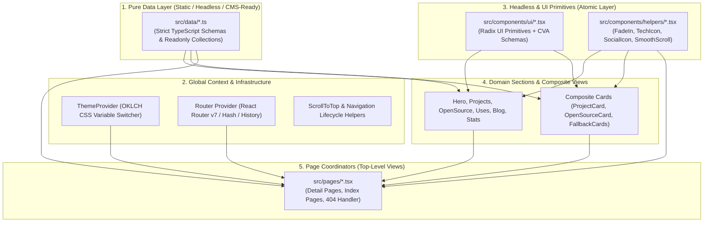
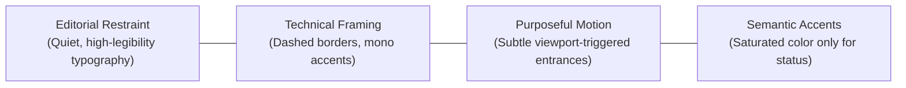

# The Gold Standard: Web Application Architecture & Design System Spec

> **A Reference Architecture & Engineering Blueprint for High-Performance, Editorial-Grade Web Applications.**  
> Derived from the architectural patterns, design principles, and engineering discipline of this repository.

---

## 1. Architectural Blueprint & System Topology

This architecture enforces **strict unidirectional dependency flow**, **zero-overhead rendering**, and a **clean separation of data, logic, and presentation**.



### Unidirectional Dependency Rules

1. **Primitives Are Independent:** Files in `src/components/ui/` and `src/lib/` must never import from `pages/`, `data/`, or domain `components/`. They are agnostic to business domain logic.
2. **Pages Are Coordinators:** Route pages in `src/pages/` coordinate data selection, URL route parameters, and viewport animations. They do not hold raw content arrays or inline CSS definitions.
3. **Data Is Sovereign:** All text, metadata, project records, and external links are strictly isolated in `src/data/*.ts`.

---

## 2. Directory Taxonomy & Layer Responsibilities

```
src/
├── main.tsx                  # App entry point, routing tree, global providers
├── App.tsx                   # Main index page layout coordinator
├── index.css                 # OKLCH color engine, keyframes, typography resets
├── data/                     # Data Domain: Readonly collections and strict schemas
│   ├── projects.ts           # Project records & Project interface
│   ├── opensource.ts         # Pull requests, repository metadata & interfaces
│   ├── uses.ts               # Hardware, tooling, software stack records
│   ├── blog.ts               # Markdown metadata & blog post schemas
│   ├── tech.ts               # Technical competencies & icon mappings
│   └── socials.ts            # Network URLs & social identity
├── lib/                      # Core Utilities: Logic, math, motion variants
│   ├── utils.ts              # cn() class merging utility (clsx + tailwind-merge)
│   ├── motionVariants.ts     # Standardized Framer Motion transition schemas
│   └── fingerprint.ts        # Client-side analytics/identification utilities
├── components/
│   ├── ui/                   # Atomic UI: Radix headless primitives + CVA variants
│   │   ├── button.tsx        # Polymorphic slot button
│   │   ├── button-variants.ts# CVA variant configuration
│   │   ├── tabs.tsx          # Accessible tab list & trigger primitives
│   │   ├── accordion.tsx     # Animated collapsibles
│   │   └── separator.tsx     # Accessible divider primitives
│   ├── helpers/              # Cross-Cutting UX: Viewport and animation helpers
│   │   ├── FadeIn.tsx        # Viewport-aware entrance wrapper
│   │   ├── ScrollToTop.tsx   # Route-change scroll manager
│   │   └── TechIcon.tsx      # SVG icon mapper & fallback handler
│   ├── [DomainSections].tsx  # Section blocks: Hero, UsesSection, ProjectSection
│   └── [DomainCards].tsx     # Reusable presentation cards: ProjectCard, BlogCard
├── features/                 # Modular capabilities (e.g. theme switcher)
│   └── theme/                # ModeToggle & theme switching logic
└── pages/                    # Route entry points: Detail views, Indexes, 404
```

---

## 3. Design Philosophy: The Monochrome Technical Editorial

This design system avoids commercial UI clichés—no neon gradients, heavy card drop-shadows, or cluttered banners. Instead, it balances the elegance of a **technical notebook** with the restraint of an **editorial journal**.



### The Three Core Pillars

1. **Restraint Over Decoration:** White space is active space. Hierarchy is established through font weight, tracking, and scale rather than loud color fills or thick drop shadows.
2. **Technical Framing (Dashed Borders):** Uses dashed borders (`border border-dashed border-border/80`) to evoke architectural blueprints and wireframes.
3. **Narrow Reading Column:** All core content is constrained to `max-w-3xl` (`768px`) with `px-6` padding. This guarantees optimal line lengths (~65-75 characters per line) on widescreen monitors while remaining edge-to-edge on mobile.

---

## 4. Color Architecture: OKLCH Token Engine

The color system uses **OKLCH (Oklab Lightness Chroma Hue)** custom properties defined in `src/index.css`. This ensures uniform perceptual lightness across light and dark modes.

### Palette Allocation: The 60-30-10 Rule

| Proportion | System Role | CSS Variable / Class | Description |
| :--- | :--- | :--- | :--- |
| **60% Canvas** | Backgrounds & Panels | `bg-background`, `bg-card` | Clean canvas with zero tinting in light mode, deep carbon in dark mode. |
| **30% Structure** | Typography & Borders | `text-foreground`, `text-muted-foreground`, `border-border/60` | High-contrast body copy, calm secondary descriptions, dashed wireframes. |
| **10% Signals** | Semantic State Accents | `text-purple-500`, `text-emerald-500`, `text-rose-500` | Saturated color is strictly an **information carrier**, never background fluff. |

### Semantic Color Signals
- **Merged PR / Highlight:** Purple (`text-purple-500`, `bg-purple-500/10`)
- **Active / Online / Open:** Emerald (`text-emerald-500`, `bg-emerald-500/10`)
- **Closed / Deprecated / Bug:** Rose (`text-rose-500`, `bg-rose-500/10`)
- **Draft / In-Progress:** Amber (`text-amber-500`, `bg-amber-500/10`)

---

## 5. Responsive Typography Scale Matrix

Never use arbitrary, static font sizes. All text follows an authoritative responsive ladder where mobile viewports remain compact and legible, and desktop viewports scale gracefully.

| Element Role | Mobile (`< 640px`) | Desktop (`≥ 640px`) | Weight | Tracking | Recommended Tailwind Classes |
| :--- | :--- | :--- | :--- | :--- | :--- |
| **Hero Display (`h1`)** | `28px` (`text-3xl`) | `48px` (`sm:text-5xl`) | `font-light` | `tracking-tight` | `text-3xl sm:text-5xl font-light tracking-tight` |
| **Page Title (`h1`)** | `24px` (`text-2xl`) | `36px` (`sm:text-4xl`) | `font-light` | `tracking-tight` | `text-2xl sm:text-4xl font-light tracking-tight` |
| **Section Header (`h2`)** | `24px` (`text-2xl`) | `30px` (`sm:text-3xl`) | `font-light` | `tracking-tight` | `text-2xl sm:text-3xl font-light tracking-tight` |
| **Sub-heading / Card Title**| `16px` (`text-base`)| `18px` (`sm:text-lg`) | `font-light` | `tracking-tight` | `text-base sm:text-lg font-light tracking-tight` |
| **Body & Longform Copy** | `16px` (`text-base`)| `16px` (`text-base`) | `font-light` | `normal` | `text-base font-light text-muted-foreground leading-relaxed` |
| **Interactive Triggers & Tabs**| `14px` (`text-sm`)| `15px` (`sm:text-base`)| `font-normal`| `normal` | `text-sm sm:text-base font-normal` |
| **Metadata / Badges / Tags**| `11px` - `12px` | `12px` (`text-xs`) | `font-light` / `font-mono` | `normal` | `text-xs text-muted-foreground/70` |

### Typography Golden Rules
1. **Headings Are Light:** Titles use `font-light` or `font-normal` paired with `tracking-tight`. Never use heavy `font-bold` for large titles; thin, tight letterforms convey craftsmanship.
2. **Mobile Readability Baseline:** Body text must never drop below `16px` (`text-base`) on mobile to guarantee readability and prevent automatic mobile browser input zoom.
3. **Metadata Monospace:** Dates, PR hashes, and terminal commands use `font-mono` (`JetBrains Mono`), keeping technical data distinct from prose.

---

## 6. Headless Primitives & Component Architecture

Reusable UI components must decouple **behavior**, **styling**, and **rendered DOM tags**.

### A. The CVA (Class Variance Authority) Pattern
Component styles are stored in separate `*-variants.ts` files to keep JSX clean and provide type-safe props:

```typescript
// src/components/ui/button-variants.ts
import { cva, type VariantProps } from "class-variance-authority";

export const buttonVariants = cva(
  "inline-flex items-center justify-center gap-2 rounded-lg font-normal transition-colors focus-visible:outline-none disabled:opacity-50",
  {
    variants: {
      variant: {
        default: "bg-primary text-primary-foreground hover:bg-primary/90",
        outline: "border border-dashed border-border/80 bg-transparent hover:bg-accent",
        ghost: "hover:bg-accent hover:text-accent-foreground",
      },
      size: {
        sm: "h-8 px-3 text-xs",
        default: "h-9 px-4 text-sm",
        lg: "h-11 px-6 text-base",
      },
    },
    defaultVariants: {
      variant: "default",
      size: "default",
    },
  }
);

export type ButtonVariants = VariantProps<typeof buttonVariants>;
```

### B. Polymorphic `asChild` Rendering (Radix Slot)
Eliminates duplicate wrapper classes across `<a>`, `<button>`, and router `<Link>` elements:

```tsx
// src/components/ui/button.tsx
import { Slot } from "@radix-ui/react-slot";
import { cn } from "@/lib/utils";
import { buttonVariants, type ButtonVariants } from "./button-variants";

interface ButtonProps extends React.ButtonHTMLAttributes<HTMLButtonElement>, ButtonVariants {
  asChild?: boolean;
}

export function Button({ asChild = false, className, variant, size, ...props }: ButtonProps) {
  const Comp = asChild ? Slot : "button";
  return <Comp className={cn(buttonVariants({ variant, size }), className)} {...props} />;
}
```

---

## 7. Motion Choreography & Entrance Systems

Animations should be **quiet and cinematic**—enhancing comprehension without slowing down navigation.

### A. Viewport-Aware `<FadeIn>` Wrapper
Every page and section relies on a unified viewport observer:

```tsx
// src/components/helpers/FadeIn.tsx
import { motion, type HTMLMotionProps, type Variants } from "framer-motion";

interface FadeInProps extends HTMLMotionProps<"div"> {
  delay?: number;
  duration?: number;
  yOffset?: number;
}

export function FadeIn({
  children,
  delay = 0,
  duration = 0.45,
  yOffset = 16,
  className,
  ...props
}: FadeInProps) {
  const variants: Variants = {
    hidden: { opacity: 0, y: yOffset },
    visible: {
      opacity: 1,
      y: 0,
      transition: { delay, duration, ease: [0.21, 0.47, 0.32, 0.98] },
    },
  };

  return (
    <motion.div
      variants={variants}
      initial="hidden"
      whileInView="visible"
      viewport={{ once: true, margin: "-40px" }}
      className={className}
      {...props}
    >
      {children}
    </motion.div>
  );
}
```

### B. Motion Principles
- **`once: true` is Mandatory:** Never trigger repeat entrance animations when users scroll back up.
- **Negative Viewport Margins (`-40px`):** Triggers animations slightly before elements enter the screen edge, creating an organic arrival.
- **Hardware-Accelerated CSS Keyframes:** Use CSS `@keyframes` for continuous or interactive animations (accordion collapsing, pulsing dots) to avoid JavaScript thread jank.

---

## 8. Defensive CSS & Micro-Layout Standards

Subtle layout bugs degrade user experience. Apply these defensive patterns universally:

1. **`shrink-0` on All SVGs & Icons:**
   In flex containers, SVG icons will distort and squeeze if adjacent text wraps on small screens unless `shrink-0` is explicitly set:
   ```tsx
   <ChevronRight className="w-4 h-4 shrink-0 text-muted-foreground" />
   ```
2. **`min-w-0` on Text Truncation Containers:**
   CSS flex children ignore `truncate` and `line-clamp-*` unless the immediate container has `min-w-0`:
   ```tsx
   <div className="flex items-center justify-between gap-4">
     <div className="min-w-0 flex-1">
       <p className="truncate text-base">{longTitle}</p>
     </div>
   </div>
   ```
3. **Dual-Theme Asset Parity:**
   Never assume external logos or diagrams work in dark mode with CSS inversion. Pair assets explicitly:
   ```tsx
   
   
   ```
4. **Sticky Navbar Backdrop:**
   Sticky headers must combine semi-transparent background with backdrop blur:
   ```tsx
   <header className="sticky top-0 z-50 w-full bg-background/80 backdrop-blur-md border-b border-dashed border-border/60">
   ```

---

## 9. Standard Page Blueprint (Template)

All route pages follow this identical, muscle-memory blueprint to preserve global consistency:

```tsx
import { FadeIn } from "@/components/helpers/FadeIn";
import { ChevronLeft } from "lucide-react";
import { useNavigate } from "react-router-dom";

export default function StandardPage() {
  const navigate = useNavigate();

  return (
    <main className="mx-auto flex w-full max-w-3xl flex-col px-6 pt-6 pb-8 sm:pt-12 sm:pb-24 space-y-8">
      {/* 1. Back Navigation Action */}
      <FadeIn yOffset={10} duration={0.35}>
        <button
          onClick={() => navigate(-1)}
          className="flex w-fit items-center gap-2 text-md font-light tracking-tight text-muted-foreground hover:text-foreground transition-colors cursor-pointer"
        >
          <ChevronLeft size={16} strokeWidth={2} />
          Back
        </button>
      </FadeIn>

      {/* 2. Page Header Block */}
      <FadeIn delay={0.1}>
        <div className="flex flex-col gap-2">
          <h1 className="text-2xl font-light tracking-tight sm:text-4xl text-foreground">
            Page Title
          </h1>
          <p className="text-base text-muted-foreground font-light leading-relaxed">
            Concise, editorial-grade description of this section.
          </p>
        </div>
      </FadeIn>

      {/* 3. Structural Dashed Divider */}
      <div className="w-full h-px bg-border/60 border-dashed" />

      {/* 4. Content Area */}
      <FadeIn delay={0.15}>
        {/* Child items / cards / interactive tabs */}
      </FadeIn>
    </main>
  );
}
```

---

## 10. Quality Gates & Verification Standards

Before merging, deploying, or concluding work on any branch:

```bash
# 1. Type & Build Verification
bun run build # (or npm run build / pnpm run build)
```

### Mandatory Verification Checklist
- [ ] **Zero TypeScript Errors:** Strict type checks (`tsc -b`) succeed with 0 errors.
- [ ] **No Inlined Dummy Data:** All data records are defined in `src/data/*.ts`.
- [ ] **Mobile Layout Tested:** Verified at `375px`, `412px`, and `768px` breakpoints.
- [ ] **No Horizontal Scroll:** Page remains strictly within bounds with zero horizontal overflow.
- [ ] **Dark & Light Mode Tested:** High contrast verified across both theme variants.
- [ ] **Performance:** Minimal layout shifts (CLS = 0) and smooth 60fps Framer Motion transitions.
